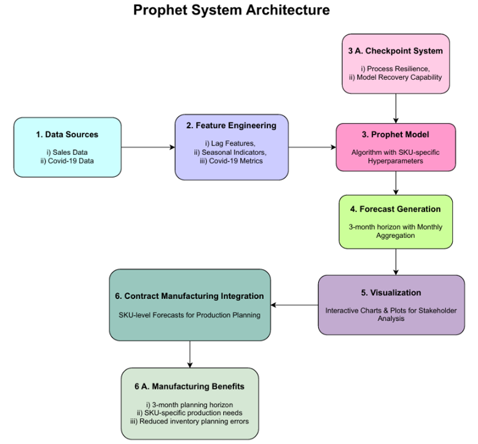
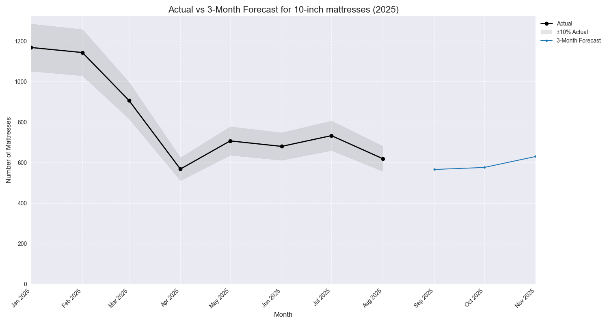
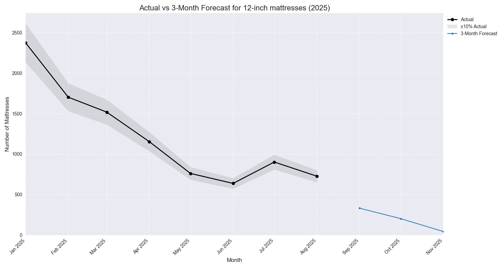
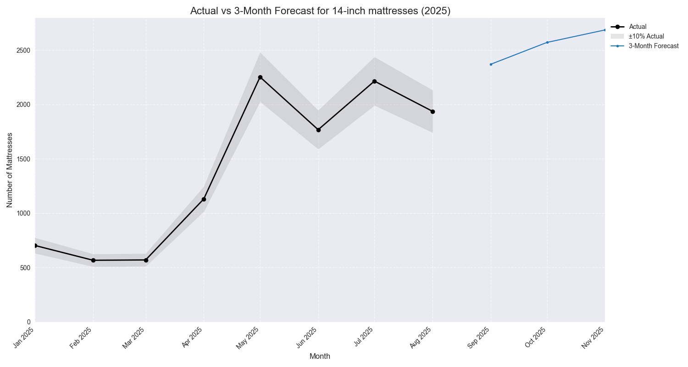
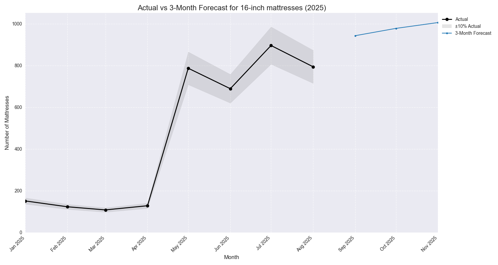

# DemandLens: Enhancing Forecast Accuracy Through Product-Specific Hyperparameter Optimization

[](https://opensource.org/licenses/MIT)

This repository contains the official code for the paper accepted at the **2025 Advances in Science and Engineering Technology International Conferences (ASET)**.

**Authors:** Srijesh Pillai, M. I. Jawid Nazir  
**Paper Link:** https://arxiv.org/abs/2509.11085

---

## Abstract
> DemandLens demonstrates an innovative Prophet-based forecasting model for the mattress-in-a-box industry, incorporating COVID-19 metrics and SKU-specific hyperparameter optimization.
> Our approach addresses the critical need for accurate Sales Forecasting in an industry that is heavily dependent on third-party Contract Manufacturing.
> The model demonstrates strong predictive capabilities through SKU-specific Hyperparameter optimization, offering Contract Manufacturers and Mattress brands a reliable tool to streamline supply chain operations.

---

## System Architecture

The project is designed as a modular, end-to-end forecasting pipeline that processes raw sales and COVID-19 data to produce actionable, SKU-level monthly forecasts for manufacturing integration.



---

## Key Results: SKU-Level Forecast Performance

The model generates accurate 3-month forecasts tailored to the unique demand patterns of each product SKU. The plots below show the model's performance against actual sales data.

| 10-inch Mattress Forecast | 12-inch Mattress Forecast |
| :---: | :---: |
|  |  |
| **14-inch Mattress Forecast** | **16-inch Mattress Forecast** |
|  |  |

---

## How to Reproduce the Analysis

### 1. Setup

First, clone the repository to your local machine:
```bash
git clone https://github.com/YOUR_USERNAME/demandlens-forecast-model.git
cd demandlens-forecast-model
```

### 2. Place the Data

This repository does not include the raw data. You must place the required CSV files into the data/ directory:
```bash
data/Sales Historical Data - 19th Sep 2025.csv
data/Forecasting for Mattresses - Covid Data.csv
```

### 3. Install the dependencies

Create a Python virtual environment and install the required libraries from the requirements.txt file:
```bash
# Create a virtual environment (recommended)
python -m venv venv
source venv/bin/activate  # On Windows: venv\Scripts\activate

# Install dependencies
pip install -r requirements.txt
```

### 4. Run the Forecast

Execute the main script. The script will ask if you want to start fresh; type 'y' for the first run.
```bash
python run_forecast.py
```

The script will perform the full end-to-end process:
1. Load historical sales and COVID-19 data.
2. Perform feature engineering (lags, seasonal flags, smoothed COVID metrics).
3. Train a separate Prophet model for each SKU using optimized hyperparameters.
4. Generate a 3-month forecast.
5. Save the final aggregated forecast to forecast_results.csv.
6. Generate and save performance plots to the outputs/ directory (previously named 'Forecast Plots').
